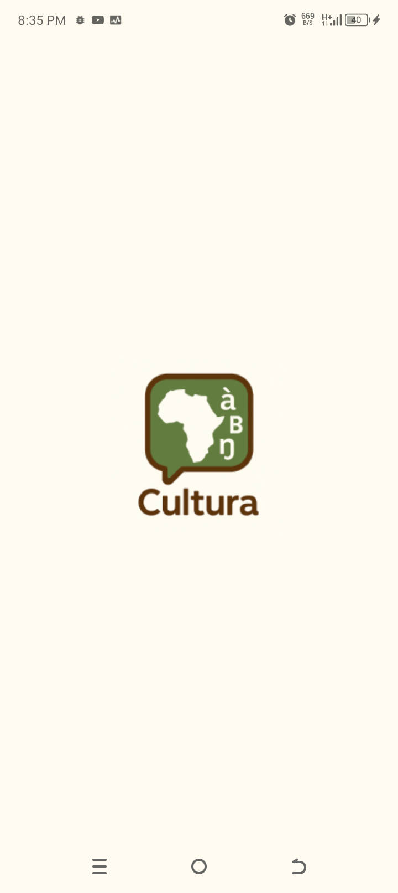
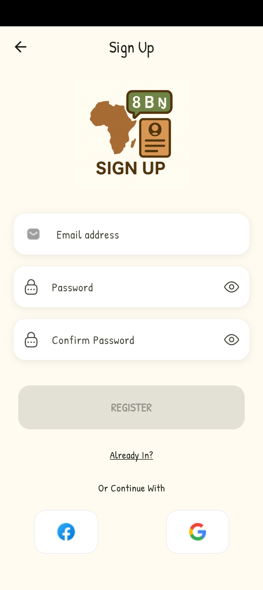
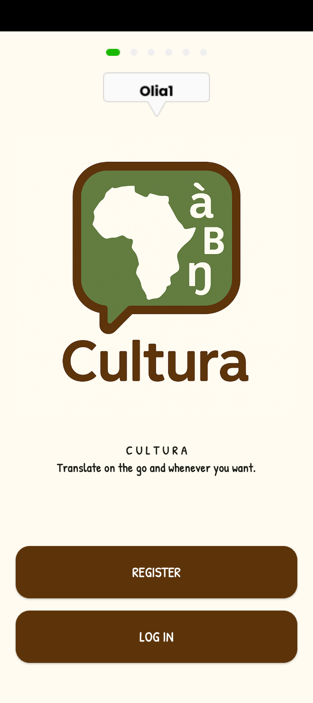
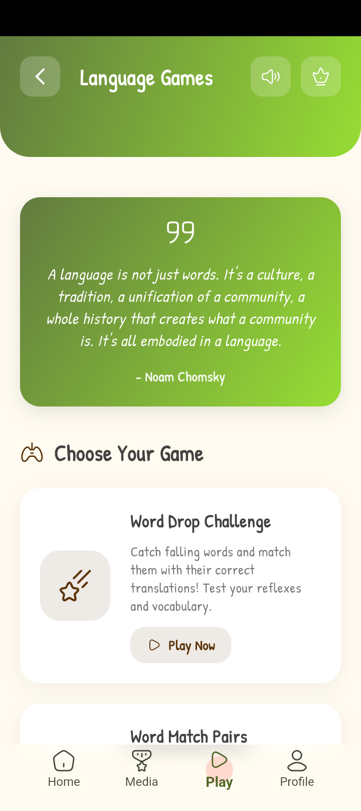
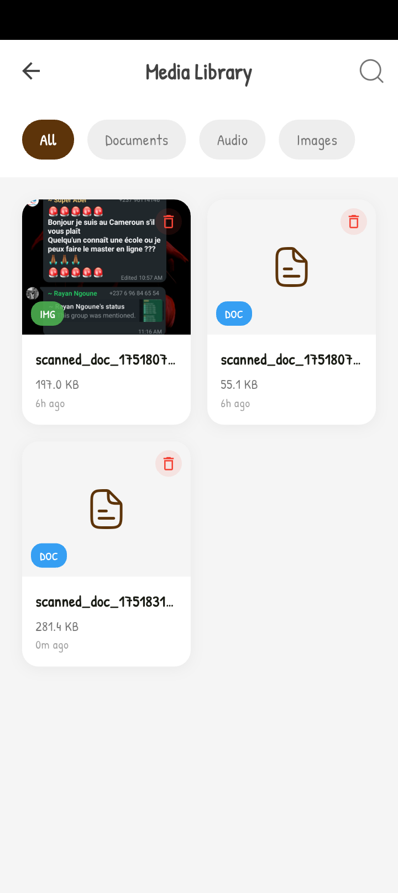
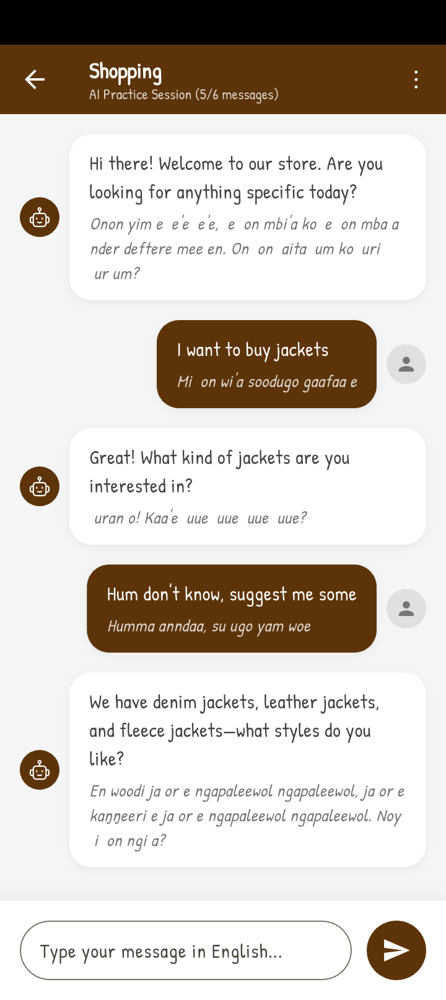

# 🌍 Cultura – Preserving Cameroon's Linguistic Heritage

[](https://flutter.dev)
[](LICENSE)
[](https://huggingface.co)

> Every word counts. So does the culture.

Cultura is a revolutionary Flutter application designed to preserve, teach, and revitalize Cameroon's indigenous languages through cutting-edge AI and immersive learning experiences.

## 📝 Description
Cultura is a mobile application dedicated to preserving and revitalizing Cameroon's vernacular languages. Built with Flutter, it provides an interactive and engaging platform for learning local languages, translating and speaking with documents, through various features including translations, stories, and cultural content.

## ✨ Features

### 🎯 AI-Powered Language Tools
- Realtime Translation
- Translation with custom models (Powered by our FLAN-T5 model)
- Document Translation (OCR scanning)
- Translation History

### 📚 Cultural Content
- Cultural Stories
  - Context-based learning
  - Short stories with translations
  - Cultural and historical narratives
- Scenario-Based Learning
  - Practical situations (market, healthcare, traditions)

### Core Functionalities
- Interactive Games (Quizzes, Word Hunts)
- Multi-device compatibility
- Offline support
- Progress tracking with achievement badges

## 📱 Screenshots
<div align="center">
  
  
  
  
</div>
<div align="center">
  
  
  
  
</div>

## 🚀 Getting Started

### Prerequisites
- Flutter 3.27 or later
- Dart SDK
- Android Studio / VS Code
- Git

### Installation
```bash
# Clone the repository
git clone https://github.com/Nde-Dilan/Cultura.git

# Navigate to the project directory
cd Cultura-app

# Install dependencies
flutter pub get

# Run the app
flutter run
```

## 🧠 AI Backbone
Our translation engine uses a fine-tuned FLAN-T5 model optimized for:
- ✅ Low-resource efficiency (8-bit quantization + LoRA adapters)
- ✅ Cultural accuracy (Trained on Fulfulde Bible corpus + community datasets)
- ✅ Scalability (Future support for Bamoun, Ewondo, Bassa)

Model Details:

```python
from transformers import AutoModelForSeq2SeqLM
model = AutoModelForSeq2SeqLM.from_pretrained("gervaisazangati/flan-t5-ft-fub2fr")
```

## 💼 Business Model

| Tier | Price | Features |
|------|-------|----------|
| Freemium | Free | Basic text translation, 3 daily games (5-10 mins/day) |
| Premium | 2,000 XAF/mo | Document/Image OCR, Full courses, Certifications |

Institutional Partners:
- Ministry of Culture and Education of Cameroon
- Universities and linguistic research centers
- NGOs focused on African language preservation
- Local radio stations

## 🌐 Roadmap
- Q3 2025: Add Ewondo and Bamoun language support
- Q1 2026: Launch certification program
- 2027: Expand to 15 Cameroonian languages

## 🤝 Contributing
We welcome:
- Native speakers for language validation
- Flutter developers
- AI/NLP researchers

```bash
# Development workflow
git checkout -b feature/your-contribution
flutter test
git commit -m "Add: [Your Feature]"
```

## 📜 License
MIT © Cultura Team

Built with ❤ in Yaoundé, Cameroon

[](https://doi.org/10.5281/zenodo.123456)

> "When an elder dies, a library burns." – Let's digitize these libraries together.